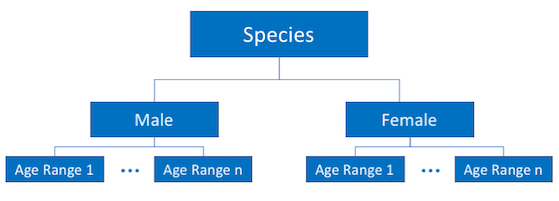

.. _species:

=====================
Species (Populations)
=====================

.. py:currentmodule:: popdyn

.. contents:: Table of contents
    :depth: 2
    :local:

Popdyn species are created independently to solve their population (without any regard for parameters or a domain), and
possess unique traits which are specified using the Species Classes:

.. autosummary::
    Species
    Sex
    AgeGroup

Species may possess attributes in a hierarchy, whereby the entire species, an individual sex (gender), or range of ages (stage group) can be
customized separately. For convenience, species attributes in a model domain are inherited using the hierarchy outlined
in the figure below. Species are linked in the model domain using their name, which is the minimum requirement to
create a species.

.. note:: For inheritance to Sex and Age Ranges to work, the species names must align

The Species Class
-----------------

Attributes related to a specific species are specified in the Species Class. These attributes are inherited by Sexes
or Age Groups of species with the same name if they are added to a model domain.

**Dispersal** is also applied through the :meth:`~Species.add_dispersal` method, see :ref:`dispersal` for further information
on these methods.

.. autoclass:: Species
    :members:

Sexes (Gender)
--------------

A species that has information related to Sex (gender), but age (stage groups) are optional. The ``Sex`` Class:

.. autoclass:: Sex

Age (Stage) Groups
------------------

A species that has both sex and age information is created using the ``AgeGroup`` class:

.. autoclass:: AgeGroup
